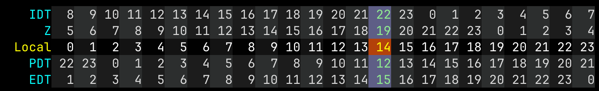

# Clockscale

A terminal UI for viewing multiple timezones at a glance in a scrollable 24-hour grid. Useful for terminal dashboards, HUDs, or anyone who regularly works across time zones.

This is a Go port of an old Ruby app of mine — rewritten for better performance and easier distribution as a single binary.

---

## Screenshot



---

## Features

- 24-hour rolling grid, one row per timezone
- Current hour highlighted across all rows
- Local timezone cell highlighted distinctly
- Alternating column shading for easy scanning
- Add/remove timezones interactively or by editing the config file
- Config reloads automatically on each tick — no restart needed
- Fully configurable colors

---

## Installation

### Homebrew

```bash
brew tap dphase/clockscale-go https://github.com/dphase/clockscale-go
brew install clockscale
```

### From source

Requires Go 1.21+.

```bash
git clone https://github.com/dphase/clockscale-go
cd clockscale-go
go build -o clockscale .
./clockscale
```

### Go install

```bash
go install github.com/dphase/clockscale-go@latest
```

---

## Keybindings

| Key | Action |
|---|---|
| `←` / `→` | Scroll grid left/right |
| `a` | Add a timezone |
| `d` | Remove a timezone |
| `r` | Reload config file |
| `?` / `/` | Toggle help overlay |
| `q` / `Ctrl+C` | Quit |

---

## Configuration

Config is stored at `~/.config/clockscale/config.json` and is created automatically on first run with a default set of timezones.

```json
{
  "timezones": [
    { "timezone": "Israel", "label": "IDT" },
    { "timezone": "Zulu", "label": "Z" },
    { "timezone": "US/Central", "label": "Local", "local": true },
    { "timezone": "US/Pacific", "label": "PDT" },
    { "timezone": "US/Eastern", "label": "EDT" }
  ],
  "colors": {
    "defaultTimezoneLabel": { "bg": "default", "fg": "#02ffff" },
    "localTimezoneLabel": { "bg": "default", "fg": "#ffff00" },
    "defaultCell": {
      "evenBg": "#1c1c1c",
      "oddBg": "#2d2e2e",
      "fg": "#dadada"
    },
    "currentTimeCells": {
      "default": { "bg": "#5e5e86", "fg": "#90ee90" },
      "local": { "bg": "#b4420a", "fg": "#ffff00" }
    }
  }
}
```

Timezone names must be valid [IANA timezone identifiers](https://en.wikipedia.org/wiki/List_of_tz_database_time_zones) (e.g. `America/New_York`, `Europe/London`, `Zulu`).

The `"local": true` flag marks which row receives the distinct orange highlight for the current hour.

---

## Requirements

- Terminal with true color support
- Minimum 80 columns recommended
- macOS or Linux
